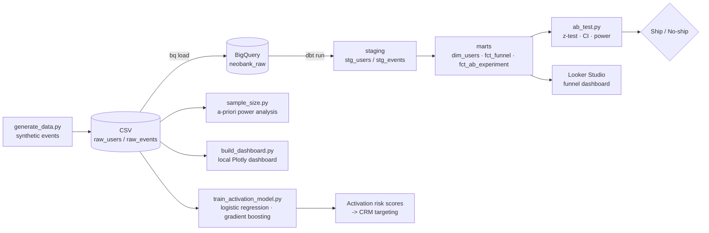

# Neobank Product Analytics — End-to-End ELT, Experimentation & ML

An end-to-end product-analytics pipeline for a fictional neobank, built on the
modern data stack. Raw product events are loaded into **BigQuery**, modelled
with **dbt**, analysed with **SQL**, an onboarding **A/B test** is evaluated
with a two-proportion z-test, a **predictive model** scores post-signup
activation risk, and the whole thing is covered by **tests + CI**.

> **The business question:** the growth team rolled out a new, lighter
> onboarding flow to half of new users. *Did it actually increase signup
> completion — and is the lift big enough and certain enough to ship to
> everyone?* And separately: *which users are likely to drop off after
> signing up, and where should the team focus next?*

---

## Architecture



## Stack

| Layer | Tool |
|-------|------|
| Data generation | Python (pandas, numpy) |
| Storage / warehouse | Google BigQuery (free sandbox) |
| Transformation / modelling | dbt (staging → marts, tests, docs) |
| Analysis | SQL + Python (scipy) |
| Machine learning | scikit-learn (logistic regression, gradient boosting) |
| Visualisation | Looker Studio (cloud) + Plotly (local, zero-setup) |
| Testing / CI | pytest, ruff, GitHub Actions |

## Repo structure

```
neobank-product-analytics/
├── scripts/
│   ├── generate_data.py        # synthetic events with a baked-in A/B effect
│   └── load_to_bigquery.sh     # bq load helper (the "EL" of ELT)
├── neobank_dbt/                # dbt project
│   ├── dbt_project.yml
│   ├── profiles.example.yml    # BigQuery connection template
│   └── models/
│       ├── staging/            # stg_users, stg_events (+ sources, tests)
│       └── marts/              # dim_users, fct_funnel, fct_ab_experiment
├── analysis/
│   ├── ab_test.py              # two-proportion z-test, CI, power, recommendation
│   └── sample_size.py          # a-priori sample size / MDE calculator
├── ml/
│   └── train_activation_model.py   # who activates after signup? (logreg + GBM)
├── dashboard/
│   └── build_dashboard.py      # self-contained local HTML dashboard (Plotly)
├── notebooks/
│   └── eda.ipynb               # exploratory walk-through with charts & commentary
├── tests/                      # pytest unit tests for the stats & data generator
├── docs/
│   └── ad_hoc_queries.sql      # funnel drop-off, cohorts, segments (window fns)
├── .github/workflows/ci.yml    # tests + lint on every push, no cloud creds needed
├── requirements.txt / requirements-dev.txt
└── .gitignore
```

---

## How to run it

### Phase 0 — Size the experiment (before collecting any data)
```bash
python -m venv .venv && source .venv/bin/activate
pip install -r requirements-dev.txt   # includes pytest, ruff, jupyter on top of requirements.txt

# "given a 62% baseline, can we detect a +2pp lift with 80% power?"
python analysis/sample_size.py --baseline 0.62 --mde 0.02
```
This is the step that should happen *before* a real experiment ships, and it's
what separates "we ran a test" from "we designed a test." See
`analysis/sample_size.py` for the closed-form formula and reasoning.

### Phase 1 — Generate the data (no cloud needed)
```bash
python scripts/generate_data.py --n-users 50000 --seed 42
```
You can already run the A/B test straight off the CSVs:
```bash
python analysis/ab_test.py --source local --step signup_completed
```

### Phase 2 — Load into BigQuery
1. Create a free BigQuery sandbox project in the Google Cloud console.
2. Authenticate the CLI: `gcloud auth application-default login`.
3. Load the raw tables:
```bash
bash scripts/load_to_bigquery.sh YOUR_GCP_PROJECT_ID EU
```

### Phase 3 — Transform with dbt
1. `pip install dbt-bigquery` (already in requirements).
2. Copy `neobank_dbt/profiles.example.yml` into `~/.dbt/profiles.yml` and fill in
   your project id.
3. Build and test:
```bash
cd neobank_dbt
dbt deps        # (no-op until you add packages)
dbt run         # builds staging + marts
dbt test        # runs the data-quality tests
dbt docs generate && dbt docs serve   # browse the lineage graph
```

### Phase 4 — Evaluate the experiment from the warehouse
```bash
python analysis/ab_test.py --source bigquery \
    --project YOUR_GCP_PROJECT_ID --dataset neobank_analytics \
    --step signup_completed
```

### Phase 5 — Explore, visualise, and predict
```bash
# exploratory notebook with charts + narrative commentary
jupyter notebook notebooks/eda.ipynb

# self-contained interactive HTML dashboard, no cloud account needed
python dashboard/build_dashboard.py
open dashboard/neobank_dashboard.html   # (or just double-click it)

# who is likely to NOT activate after signing up, and why?
python ml/train_activation_model.py --source local
```
For a cloud-hosted version, connect Looker Studio to the `fct_funnel` and
`fct_ab_experiment` BigQuery tables instead.

### Testing & CI
```bash
pytest tests/ -v
ruff check . --select=E9,F
```
`.github/workflows/ci.yml` runs the full local pipeline (data generation,
unit tests, A/B test, sample-size calculator, ML model, dashboard build) on
every push and PR — no BigQuery credentials needed, so it always runs green
on a fork.

---

## Results

*(Numbers below are from the default run: 50k users, seed 42.)*

| Variant | signup_completed | n |
|---------|-----------------:|--:|
| control   | 62.0% | 24,814 |
| treatment | 67.9% | 25,186 |

- **Absolute lift:** +5.9 pp  ·  **Relative lift:** +9.5%
- **95% CI (difference):** [+5.1 pp, +6.7 pp]
- **p-value:** < 0.001  ·  **Power:** ~100%
- **Recommendation: SHIP** — the new onboarding flow produces a positive,
  statistically significant lift, and the lift propagates through the whole
  funnel to activation (see `notebooks/eda.ipynb` §4 for why the *absolute*
  lift shrinks step over step while the *relative* lift roughly holds).

### Segments (independent of the experiment)

The dataset also bakes in realistic, non-variant signal so there's something
real to find in EDA/dashboard/ML beyond the headline A/B result:
country affects KYC pass rate (AE lags PT/ES/GB/PL), platform affects deposit
behaviour (`web` lags `ios`/`android`), and night-time signups follow through
to a first transaction slightly less often. None of this is driven by
`variant` — see `scripts/generate_data.py` for the exact modifiers, and
`tests/test_generate_data.py` for the tests that pin this contract down.

### Machine learning: predicting post-signup activation

`ml/train_activation_model.py` answers a different, complementary question to
the A/B test: among users who already completed signup, who is unlikely to go
on to a first transaction, so Growth/CRM can target them with a nudge?
A logistic-regression baseline and a gradient-boosted model are compared on
ROC-AUC, PR-AUC and calibration (Brier score), with the population restricted
to post-signup users and leakage-prone steps (`kyc_submitted`,
`first_deposit`) deliberately excluded from the features. Run it yourself for
exact numbers; by construction `variant` should come out with ~zero
importance, while country, platform and signup hour should not — a good
two-minute story for an interview about both the model *and* the data design
behind it.

---

## Notes & honesty

- The data is **synthetic** (generated, not real), modelled on a fintech
  onboarding funnel. The point is to demonstrate the pipeline, the
  experimentation workflow, and a predictive model end to end.
- The A/B effect is deliberately isolated to a single step
  (`signup_completed`) so the experiment's causal story stays clean; the
  segment effects used for EDA/ML are deliberately *not* wired into the
  experiment, so the two analyses don't contaminate each other.
- **LookML:** Looker (and its LookML modelling language) is enterprise software.
  This project uses **Looker Studio** (free) and a local **Plotly** dashboard
  instead. The semantic modelling *concept* — defining dimensions and measures
  once, reusing everywhere — is implemented here in dbt.
- **ETL vs ELT:** some job postings for this kind of role say "ETL"; this
  project deliberately builds **ELT** instead — raw data is loaded first,
  then transformed *inside* the warehouse with dbt. ELT is the modern default
  once you have a cloud warehouse; dbt exists specifically for the "T" in
  ELT. Classic ETL (transform before loading) still earns its keep for
  legacy systems or data too large to land raw, but ELT is the right default
  here.

## What this demonstrates
ELT on BigQuery · analytics engineering with dbt (staging→marts, tests, docs) ·
SQL (conditional aggregation, window functions, cohorts) · A/B testing with
proper statistics, including a-priori sample sizing · supervised ML for a
real targeting problem, with explicit leakage controls · funnel & product
analytics · automated testing and CI · translating analysis into a
commercial decision.
